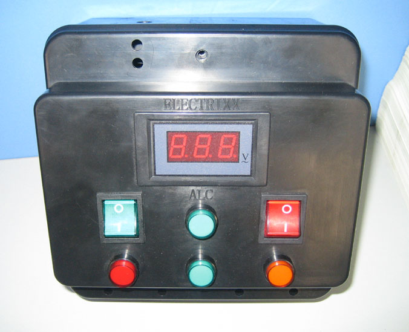
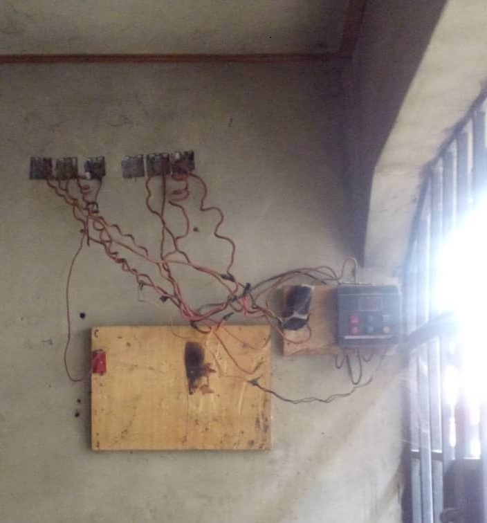
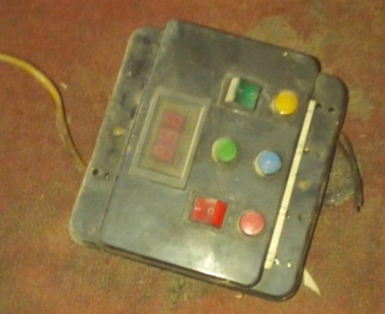
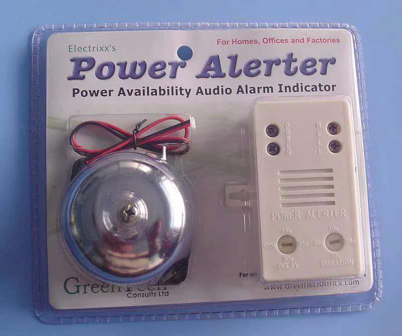

# ALC and PowerAlerter
Automatic Line Changer : Helping Nigerians homes overcome the 3-Phase problem

# ALC : Automatic Line Changer
## The Problem:
Although the British left Nigeria with a fully functioning 3-Phase electrical systems that resulted in various sections of the home been wired to one of the electrical phases to implement electrical load-balancing. In the last 60 years, due to lack of maintenance electrical grid, the supply of electricity to all the 3-phases was not regular. 
## Manual Solution:
Many homes have adopted a process called **“looping”** where you manually select one of the active phases *(depicted by indicator bulbs)* and “loop” your house into it by physically removing the electrical cut-out from the dead phase and placing it on the active phase as indicated by the indicator bulbs. This was a dangerous activity that has left many people electrocuted over the years.
## My Tailored Creative Solution:
After an extensive study of the process I designed an electromechanical solution using 2 heavy-duty relays that automatically sense the failure of electrical supply to one of the 3-Phases and automatically seek and connect the house to another active phase. The change of phase happens so fast that it is not noticed by the occupants or their electrical devices. The product became a commercial success and was officially known in Nigeria as the **Automatic Line Changer (ALC)** device. I also hold a Nigerian patent for the design. 

## ALC installed at a house 

## This ALC unit retired after 15 years of service. 

------------
# AP: Power Alerter
Configuarble Electric Supply activity Alerter.

The supply of electricity in Nigeria is very sporadic, most homes get only 5 hours of electricity a day, spread across the whole day. The public resorted to using electrical generators and on many occasions are unable to identify when the electric-grid supply has been returned to the building. 
There was a need for a **audio based device** that could be configured to **run a siren or bell for a period of a few seconds**, allowing the members of the home to identify when the Electric company has supplied electric to the house so the generators could be switched off and the home can be **changed-over** to the electrical grid. 
The **Power Alerter** provided such functionality, it even allowed you in conjunction with the **ALC** (Automatic Lince Changer) to **automatically** change over your home to the Electric grid and also switch off the generator at the same time. I also hold a Nigerian patent for the design.

# Nigerian Patent Documents
Both devices shown and described above have **Patents issued in Nigeria**.
*(click Links to PDF documents)*

[Automatic Line Changer (ALC) Patent](ALC_Patent.pdf)

[Power Alerter Patent](Power_Alerter_Patent.pdf)
